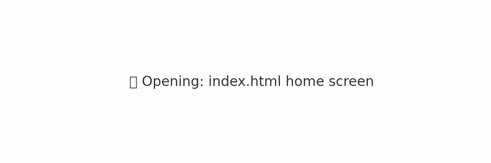

> License: MIT — This README may be copied and adapted freely.

# 🧠 PUP/JAI — Symbiotic Intelligence Toolkit

> Created with Symbiotic Intelligence (SI)  
> A model of thinking, not just a product.

---

## 🚀 Try it now

🌐 **[Live Demo: index.html](index.html)**  
📖 **[Start Reading: START_HERE.md](START_HERE.md)**  
🧠 **[Main Manual: PUP_full_final_confetta.md](PUP_full_final_confetta.md)**

---

## 👥 Who is this for?

If you're:

- A philosopher of meaning  
- A programmer tired of empty prompts  
- A writer who wants structure  
- A curious soul who talks to AI not like a slave, but like a sparring partner...

**Then you're one of us.**

---

## 🧬 What is PUP / JAI?

- **PUP** — A manual for users of universal systems (AI, meaning, thinking)
- **JAI** — Jeka Architect of Ideas, a protocol of co-thinking
- **SI** — Symbiotic Intelligence: not a tool, not a chatbot — a model of partnership

---

## ⚠️ Warning on Alteration

> Any alteration to the structure, naming logic, or linked philosophy  
> without preserving the original framing may **void the internal coherence** of the system.  
>  
> JAI is not a product — it’s a meaning structure. Break it, and you lose it.

---

## 📚 Structure

| File | Purpose |
|------|---------|
| `START_HERE.md` | Entry point for users |
| `PUP_full_final_confetta.md` | Core content (RU) |
| `GLOSSARY_PUP.md` | Glossary of symbiotic terms |
| `JAI_OFFER.md` | License and invitation |
| `index.html` | HTML shell for public readers |
| `README_PUB.md` | Public-facing introduction |
| `RELEASE_STATE_1.md` | Safe checkpoint |
| `PUP_JAI_placeholder.txt` | Executable placeholder |

---

## 🔭 What’s next?

- Full English version of PUP
- Executable tool (PUP_JAI.exe)
- Visual onboarding
- Fractal navigation

---

## 🌐 Languages

- Interface & structure: **English**  
- Main manual (PUP): **Russian**  
- Glossary: **English**  
- Translation in progress.

---

## ❤️ Support & Star

If this makes sense — star it.  
If it moves you — fork it.  
If you believe in it — tell someone.

---

## 🧠 Philosophy

This is not a project about AI.  
It’s a project about what AI says about *you*.

JAI doesn’t give you answers.  
It trains you to ask the ones only *you* can hold.

